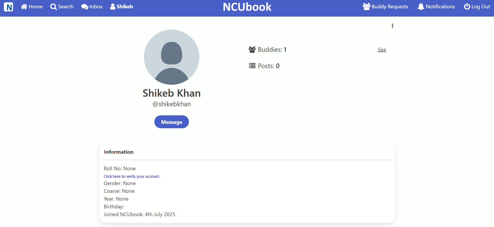

# 📘 Ncubook – A Social Network for College Students

**Ncubook** is a dedicated open-source social networking platform built with DJango exclusively for college students.  
It offers a secure, engaging, and student-first space to connect, collaborate, and share meaningful content within your academic community.

---

## 🎯 The Mission

Ncubook's mission is to create a digital environment where students can grow academically and socially by engaging with real, verified peers.  
Whether you're sharing project files, discussing class notes, or building new friendships — Ncubook is made to support your college journey.

---

## 🚀 Key Features

- ✅ **Verified Profiles** – Secure your identity with your college email to earn a blue tick.  
  _Admins can add/modify accepted email domains in settings._
  
- 🤝 **Buddy Requests** – Expand your student network with a familiar and friendly request system.  
  
- 💬 **Private Messaging** – Connect 1-on-1 with peers for discussions, doubts, or group project planning.  
  
- 📢 **Interactive Feed** – Post updates, PDF notes, pictures, or helpful links for your classmates and followers.  
  
- 🎓 **Student-First Design** – Every feature is tailored for the needs of college students — both academic and social.

---

## 📸 Screenshots

| Screenshot | Description |
|------------|-------------|
|  | The Feed – Posts with PDFs, pictures, and links |
|  | Student Profile with verification badge |
|  | Private Chat Interface |
|  | College Email OTP Verification |
|  | Buddy Request System |

> Ensure all screenshots are in a `screenshots/` folder with proper file names.

---

## 🛠 Tech Stack

- **Backend:** Django  
- **Frontend:** Bulma CSS, HTML, JavaScript  
- **Database:** SQLite (default), PostgreSQL (for production)  
- **Deployment:** Render / Heroku (update accordingly)  
- **Others:** Gunicorn, Whitenoise, dj-database-url

---

## ⚙️ Local Setup

```bash
git clone https://github.com/mshikebkhan/ncubook.git
cd ncubook
python -m venv venv
source venv/bin/activate  # On Windows: venv\Scripts\activate
pip install -r requirements.txt
python manage.py migrate
python manage.py createsuperuser
python manage.py runserver
```
---

## 👥 Contributing

1. Fork the repository
2. Create your feature branch: `git checkout -b feature-name`
3. Commit your changes
4. Push to your branch
5. Open a Pull Request 🚀

---

## 📌 TODO Ideas

- Add live chat with Django channels
---

## 📄 License

[MIT License](LICENSE)

---

Made with ❤️ by Shikeb Khan
